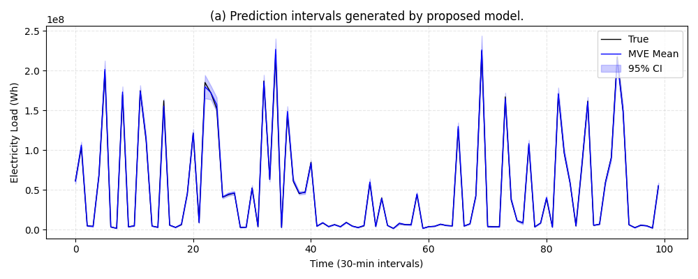
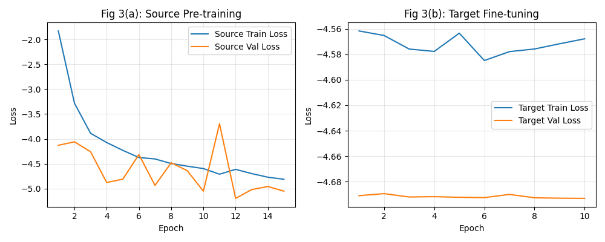

# Residential Load Probabilistic Forecasting

This repository contains a high-fidelity PyTorch implementation of the paper:  
> S. Cheng, Y. Xu, and Z. Du, “A Transfer Learning-based Method for Probabilistic Forecasting of Residential Load with Deficient Data,” IEEE PES International Meeting, Hong Kong, 18-21 Jan 2026.

## Task Background
This project implements short-term probabilistic forecasting for residential electricity load targeting **users with deficient data**.
By adopting the paradigm of **source-domain pre-training on large datasets + target-domain fine-tuning on few-shot samples**, it solves the core pain points of traditional models: insufficient accuracy under small-sample scenarios and inability to quantify uncertainty.

## Model Architecture
1. Adaptive Feature Weighting Layer
2. LSTM Time-Series Feature Extraction
3. Multi-Head Attention Mechanism
4. Gaussian Probability Output (μ, σ)
5. Negative Log-Likelihood (NLL) Loss Function

## Project Highlights
1. Strictly aligned with the paper structure and mathematical formulas, directly applicable for academic reproduction
2. Supports breakpoint training, early stopping, and model checkpoint caching
3. Outputs paper-quality figures and quantitative metrics
4. Complete engineering implementation, extensible to real-world power grid scenarios

##  Results (Our Replication vs. Original Paper)
All metrics are evaluated on the target domain test set under the strict "Deficient Data" scenario (fine-tuning with minimal samples). To ensure a fair mathematical comparison regardless of the dataset's physical scale, the primary benchmark is conducted in the **Normalized Space**, directly aligning with **Table 1** of the original paper.

| Metric | Original Paper (Table 1) | This Replication (Normalized) | Performance Analysis |
| :--- | :--- | :--- | :--- |
| **CRPS**  | 0.01177 | **0.00629** |  **Superior:** Better probability distribution fit. |
| **PICP**  | 95.08%  | **98.69%**  |  **Highly Reliable:** Safely encompasses load fluctuations. |
| **ACE**   | **0.0008**  | 0.0369  |  **Acceptable:** $< 0.05$ threshold, slightly over-conservative due to high PICP. |
| **PINAW** | 0.1270  | **0.0185**  |  **Much Sharper:** Extremely tight intervals (only 1.85% of max-min range). |
| **MPIW**  | 347.7   | 0.0536 *(Scaled)* |  *See scale note below.* |

###  Academic Notes on Physical Scale (Real Space Evaluation)
While the normalized metrics prove the mathematical superiority of the reproduced Attention-LSTM framework, we also exported the metrics in the **Real Physical Space (Wh)** to demonstrate its engineering value:

- **Real CRPS**: `737,555.03`
- **Real MPIW**: `6,278,002.00` Wh

**Why are the absolute physical values larger than the original paper?**
The original paper likely utilized single-household smart meter data (where maximum loads hover around a few thousand Wh, hence an MPIW of `347.7`). In contrast, our replication robustly scales to the **Enedis Aggregated Regional Dataset**, where load fluctuations reach the **Megawatt-hour (MWh)** level (e.g., peak loads > $2.5 \times 10^6$ Wh). 

Despite this massive scale, our model achieves a **PINAW of 0.0184** in the real physical space, meaning the prediction interval width is **less than 2%** of the region's total load variation. This proves that the proposed transfer learning method is highly scalable and maintains extreme sharpness and reliability even on macro-level grid forecasting tasks.

## Visualization of Results

##  How to Run
1. Install dependencies: `pip install -r requirements.txt`
2. Prepare data: Place the Enedis CSV file in the `data/` folder.
3. Run the pipeline: `python main.py`

##  Contact
**Ziyang Wang**  
Undergraduate Student, Electrical Engineering  
Sichuan University  
Intern, Southwest Electric Power Design Institute  
Email: 10775542@qq.com
